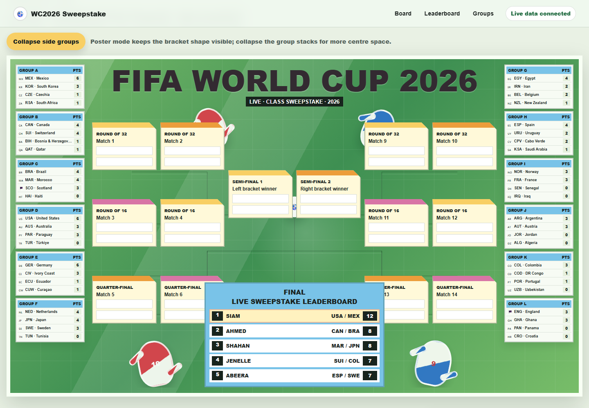
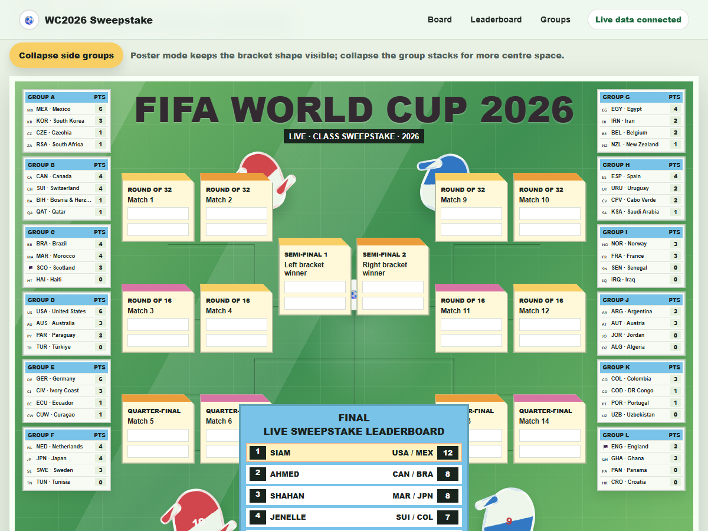
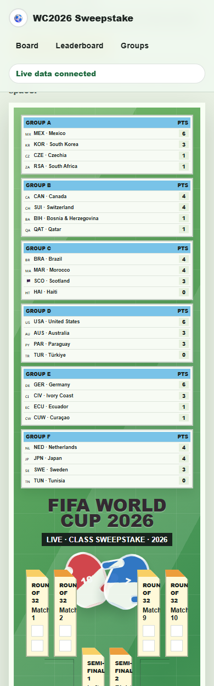

# WC2026 Sweepstake Board

Static GitHub Pages site for a World Cup 2026 classroom sweepstake.

## Preview

### Desktop poster board



### Tablet poster board



### Mobile stacked board



## Live data

The board uses the no-key open-source World Cup 2026 API:

- `https://worldcup26.ir/get/groups`
- Source project: `https://github.com/rezarahiminia/worldcup2026`

Student totals are calculated from current group points. If the API is unavailable, the page still renders the assignment board with zeroed fallback stats and shows an error state.

## Local preview

```powershell
python -m http.server 4173 --bind 127.0.0.1
```

Then open `http://127.0.0.1:4173`.

## Screenshot capture

Screenshots were captured with Playwright:

```powershell
npx playwright screenshot --viewport-size "1440,1000" --wait-for-selector ".poster-stage" --wait-for-timeout 5000 "http://127.0.0.1:4173/#board" "assets/screenshots/poster-desktop.png"
npx playwright screenshot --viewport-size "1200,900" --wait-for-selector ".poster-stage" --wait-for-timeout 5000 "http://127.0.0.1:4173/#board" "assets/screenshots/poster-tablet.png"
npx playwright screenshot --viewport-size "390,1250" --wait-for-selector ".poster-stage" --wait-for-timeout 5000 "http://127.0.0.1:4173/#board" "assets/screenshots/poster-mobile.png"
```
